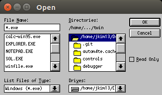
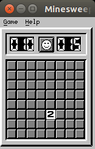
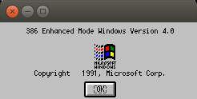
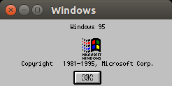
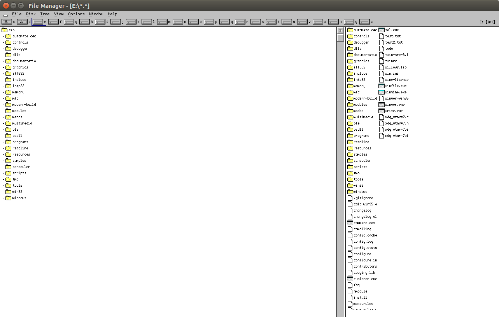
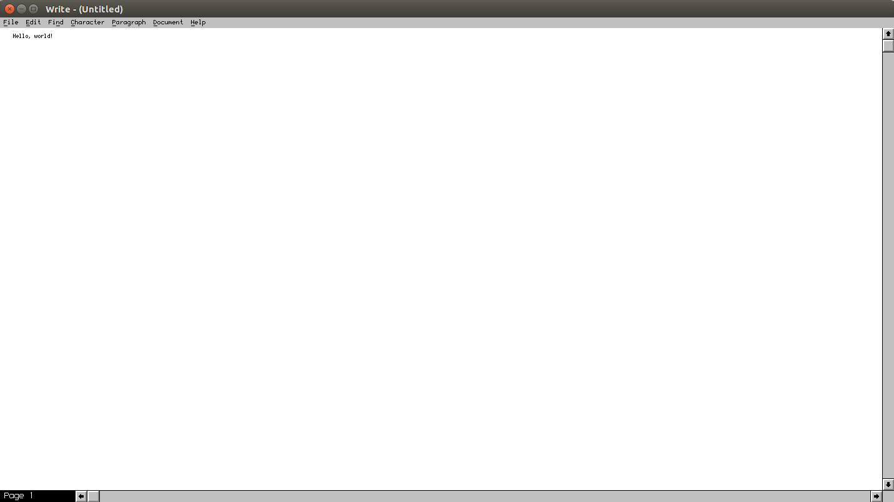

# Willows TWIN

This is an updated version of the [Willows TWIN](https://web.archive.org/web/20030807091602/http://willows.com/) software package, updated to compile with modern versions of GCC. The original source archive is [here](https://github.com/nepx/twin/blob/master/twin-src-3.1.14.tar.gz), if you're curious. The last release was sometime in 2001 and, unmodified, does not compile (or run) under modern systems. 

Currently, most 16-bit apps run fine under emulation. A few are provided in this repository for testing purposes. 32-bit apps run directly on the CPU, and future work might entail hooking up the 32-bit interpreter. 

A few test applications are provided in the repostory. All of them save `winver.exe` comes from my Windows 95 installation. They're provided for educational and testing purposes only. 

## Building

This process was tested on a Ubuntu 16.04 x86-64 system, but it should work on other Linux-based systems too. You will need GCC, `flex`, `bison`, X11 development libraries, and `make`. 

```bash
./configure --enable-intp
make depend world
LD_LIBRARY_PATH=./windows/ ./windows/xwin32
```

## Application Support

Applications in 16-bit NE format load flawlessly, but they're a unstable. `write.exe` will sometimes load, sometimes not because of an error with uppercase and lowercase filenames. `sol.exe` draws all of its cards in the upper left hand corner. 

32-bit applications will load, but crash early in execution. Perhaps hooking up the 32-bit interpreter library will solve this problem. 

## Screenshots








## License

The original Willows TWIN source code and all additional modifications are released under GPLv2. 

# Original README

```
This is the README file for the Willows TWIN library source
distribution.  For instructions on how to install the TWIN libraries
and the emulator, please see the INSTALL file.  For a list of changes
since the last release, please see the ChangeLog file.  This is the
official release of the Willows TWIN Library version 3.1.14.

IMPORTANT NOTE: 
The Willows TWIN libraries were last updated sometime in 1997. I 
added a number of quick hacks to get the emulator to compile on a 
modern Ubuntu x86-64 system. Refer to "COMPILING" for more details.

What is Willows TWIN?

Willows TWIN is a GNU software package for emulating the Microsoft
Win32 API.  It consists of a library set and an emulator program.  The
emulator program allows the execution of Windows binary applications
on supported platforms; using the native Intel x86 processors, or
through the built-in instruction set interpreter.  The native
libraries allow programmers to natively build Win32 and MFC
applications from source code.

Because Willows TWIN libraries are an implementation of the Win32
API, certain operating system features are required to build these
libraries.  The following is a list of required tools and features
for building TWIN.

	X Window System version 11
	Shared library support (dynamic library loading)
	GCC 2.7.2 or later
	Flex
	Bison
	GNU Make

The following processors are supported:

	Intel x86
	Sparc
	Alpha [1]
	PowerPC [1]

The following operating systems are supported;

	GNU/Linux
	Solaris 2.5
	HPUX 11.0 [1]
	AIX 4.3.1 [1]

[1] Not tested by maintainer.

The goal of Willows TWIN library is to allow portation of Windows
applications and execution of existing Windows binaries.


Major Changes Since Last Release

Though it has been a while since the previous release.  This release
should be considered a bug fix release only.  The following are the
major points of changes:

20010428
	o Mostly code cleanup.

19990529
	o New interpreter code.  This code base is shared with the
	  DOSEMU project.

19990407
	o Directory hierarchy now mirrors that of WINE.
	o Windows header files renamed to match spec.
	o Build from a different location than the source directory.
	o Sample applications are now re-integrated back into the
	  distribution, for debugging purposes.


Open Development model

The Willows TWIN libraries development has completely adopted the open
(bazaar) development model.  The latest development sources are
available via anonymous CVS server.  Instructions for accessing the
CVS tree can be obtained from;

	http://www.willows.com/

For the impatient, the following command can be used.

	cvs -d :pserver:cvsguest@cvs.willows.com:/cVs login

Use 'twin', without qoutes, as the password.

	cvs -d :pserver:cvsguest@cvs.willows.com:/cVs checkout -P twin

The '-P' is needed because of the directory changes since 3.1.12.  To
get the latest updates, type

	cvs -q update -P -d

from inside the 'twin' directory.

Snapshots will also be created as often as possible, depending on the
amount of contributions (changes to the cvs tree).  A mailing list is
also provided for developer discussions and user assistance.  The
Willows web page has further information about these mailing lists and
archives.


Last Notes

If anyone is interested in contributing to Willows TWIN libraries
development, please see the TODO file.  We are in need of help.  You
don't need to know how to program.  There are lots of other tasks that
need to be done.

Thank you for using the Willows TWIN libraries software.
```